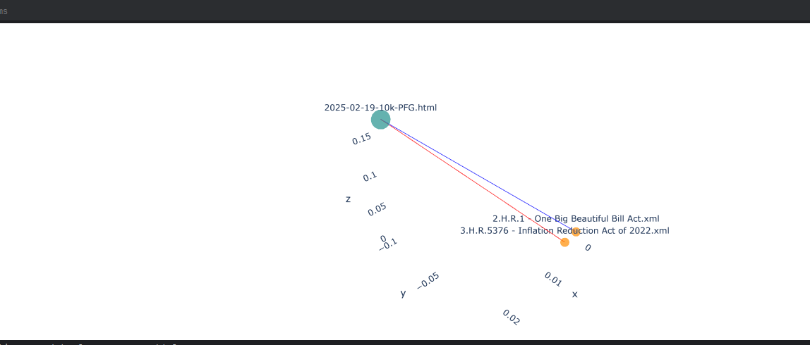
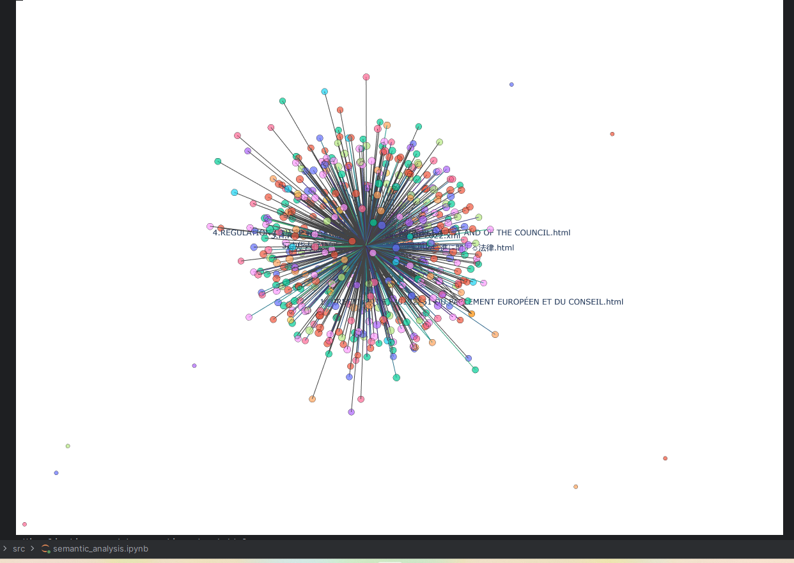

# Financial and Regulatory Data Processing Pipeline

## Overview

This project provides a **two-stage processing pipeline** to analyze financial filings and regulatory texts for companies, specifically focusing on S&P 500 stocks. It leverages **Bedrock** to summarize and extract structured data from large multilingual documents.

Additionally, it provides **semantic network analysis** for companies and directives, allowing visualization of relationships based on embeddings and clustering.

---

## Dataset

The input dataset (`jeu_de_donnees.zip`) contains:

1. **Financial datasets**:
   - `2025-08-15_composition_sp500.csv`
   - `2025-09-26_stocks-performance.csv`

The pipeline merges these two CSVs and keeps only the stocks present in both files, essentially filtering **S&P 500 companies**.

2. **Staged document CSVs**:
   - `filling_staged.csv`
     ```
     file_name,chunk_index,chunk_text,embedding
     ```
   - `regulations_staged.csv`
     ```
     file_name,chunk_index,chunk_text,embedding
     ```
   Each CSV contains:
   - `file_name`: original document name
   - `chunk_index`: chunk order
   - `chunk_text`: text content
   - `embedding`: vector representation used for semantic search and multilingual processing

---

## Bedrock Helper
#### Models used
1. global.anthropic.claude-sonnet-4-5-20250929-v1:0 (for chat generation)
2. amazon.titan-embed-text-v2:0 (for embedding) 

The project uses a custom **`bedrock_helper`** which provides:

- Document summarization for large texts  
- Structured data extraction from filings and regulations  
- Financial analysis (revenue, risk assessment, competitive advantage)  
- Regulatory analysis (impact, compliance deadlines, affected sectors)  

It serves as the **core engine** for the pipeline’s LLM-based extraction.

---

## Processing Pipeline

The pipeline consists of **two main stages**:

### 1. Chunking and Embedding

- Input documents are split into **manageable chunks**.  
- Chunks are embedded using multilingual embeddings for **semantic representation**.  
- Parallel processing is used for embeddings to **accelerate large datasets**, storing all chunks and embeddings in **staged CSVs**.  

### 2. Extraction

- Staged CSVs are **grouped by `file_name`** and sorted by `chunk_index` to maintain proper order.  
- Each document is **summarized** to allow the LLM to process all data **before answering questions**.  
- Structured data is then extracted using Bedrock, with results saved incrementally to output CSVs.

---

## Semantic Network & Clustering

The project now includes **graph-based semantic analysis** of companies and directives:

- **Nodes** represent **companies** or **directives**.  
- **Edges** reflect **semantic similarity** based on embeddings.  
- **Node sizes** dynamically scale with the number of connections to highlight central companies or directives.  
- **Company nodes** are clustered based on embedding similarity, allowing patterns to emerge visually.  
- **Interactive 3D visualizations** allow:
  - Hovering to see node names.
  - Selecting a company to see its **top-k closest companies** and connected directives.
  - Selecting a directive to see its **top-k closest companies** and related directives.
  - Irrelevant nodes and edges are dimmed or hidden to focus on relevant relationships.

This feature enables **exploration of regulatory impacts** and **company relationships** in a semantic space without showing cluttered edges.

---

## Output

### Filings (`filing_structured.csv`)

file_name,company_name,trading_symbol,fiscal_year_end,state_of_incorporation,employer_id_no,
address,phone_number,exchange,primary_sector,revenue,net_income,operating_cash_flow,
capital_expenditure,eps,pe_ratio,risk_level,top_3_risk_factors,mitigation_suggestions,
confidence_score,key_rivals,competitive_advantage,key_partners,major_investments_acquisitions

### Regulations (`regulations_structured.csv`)

file_name,country_region,law_name,primary_subject,key_requirements_summary,
affected_sectors,potential_impact_severity,specific_companies_mentioned,
companies_that_could_be_impacted,compliance_deadline,estimated_compliance_cost

---

## Key Features

- Supports **multilingual text processing** with parallel embeddings.  
- Incremental CSV saving ensures **fault tolerance**.  
- Fully parallel extraction using LLM summaries.  
- Designed for **S&P 500 filings and regulations**, but can be extended to other datasets.  
- **Semantic network visualization** with dynamic sizing, clustering, and top-k focus for companies and directives.

---

## Usage

1. **Merge datasets** to select relevant stocks.  
2. **Stage documents** (chunking + embeddings).  
3. **Run extraction pipeline** to produce structured CSV outputs.  
4. **Visualize semantic relationships**:
   ```python
   # Visualize company focus
   visualize_company_focus(G, "2025-02-19-10k-PFG.html", top_k=5)

   # Visualize directive focus
   visualize_directive_focus(G, "2.H.R.1 - One Big Beautiful Bill Act.xml", top_k=5)
   ```
    Company focused shows top directive that are influence the company
    
    Directive focused shows the top-10 most impacted by the directive
    
5. You can change the directive or company 
The following is the combined version you can zoom in and out and interact with it based on your preference
hover on the nodes to see the Ticker, the color determines the semantic similarity.
    
#### You can also change the similarity level by changing the row["similarity"] variable.

# Build guide
Prerequesites
You need aws access-token, secret-access and region and access to AmazonBedRock
0. Cofigure aws here add all access-token/key, secret-access and region
```bash
    aws-configure
```
1. Install requirements
```bash
  pip install -r requirements.txt
```
2. Merge datasets
```bash
  python .\src\data\combine_sp500_data.py
```
3. Run ingestion_pipeline in order as given
```bash
  python .\src\ingestion_pipeline.py --mode stage --doc_type filing
```
 ```bash
  python .\src\ingestion_pipeline.py --mode extract --doc_type filing
```
```bash
  python .\src\ingestion_pipeline.py --mode stage --doc_type regulation
```
```bash
  python .\src\ingestion_pipeline.py --mode extract --doc_type regulation
```
--mode stage gives chunks and embeddings of the documents
--mode extract calls llm model and gives response and they are located in src/data/structured_data
the data inside gives valuable insights to about the company and the directives depending on which files you  are looking

See sample_data folder given 

4. Lastly for visualizing and interacting with the companies go to semantic_analysis.ipynb and run everything it will give you the node network you can interact with them the color of node is determined by clustering and node length is the cosing similarity length between them.